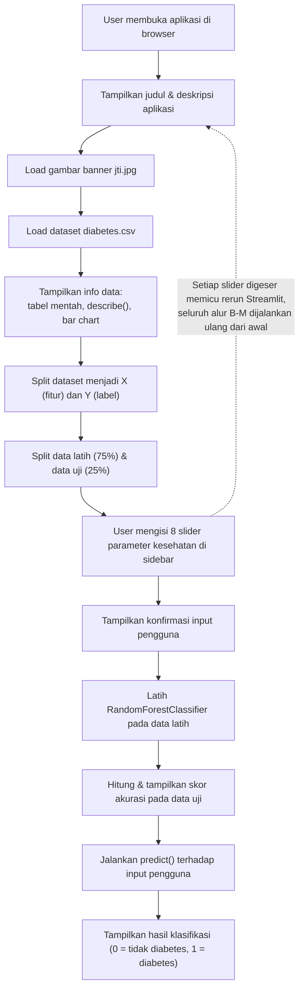

# Flow Map Aplikasi

Dokumen ini menggambarkan alur eksekusi aplikasi `WebApp.py` dari awal pengguna membuka halaman hingga hasil prediksi ditampilkan.

## Diagram Alur

## Penjelasan Tahapan

1. **Buka aplikasi** — Pengguna mengakses aplikasi melalui browser (`streamlit run WebApp.py`, default `http://localhost:8501`).
2. **Judul & deskripsi** — Streamlit merender judul "Diabetes Detection" dan deskripsi singkat aplikasi.
3. **Banner** — Gambar `jti.jpg` dimuat dan ditampilkan di bagian atas halaman.
4. **Load dataset** — `diabetes.csv` dibaca ke dalam `pandas.DataFrame`.
5. **Tampilkan info data** — Data mentah, statistik deskriptif, dan bar chart ditampilkan ke pengguna.
6. **Pisahkan fitur & label** — 8 kolom pertama dataset dijadikan `X` (fitur), kolom `Outcome` dijadikan `Y` (label).
7. **Split data latih/uji** — Dataset dibagi 75% untuk pelatihan, 25% untuk pengujian.
8. **Input pengguna** — Pengguna menggeser 8 slider di sidebar untuk memasukkan data kesehatannya.
9. **Konfirmasi input** — Nilai yang dimasukkan ditampilkan kembali dalam bentuk tabel.
10. **Latih model** — `RandomForestClassifier` dilatih menggunakan data latih.
11. **Skor akurasi** — Akurasi model dihitung terhadap data uji dan ditampilkan.
12. **Prediksi** — Model memprediksi hasil klasifikasi berdasarkan input pengguna.
13. **Tampilkan hasil** — Hasil klasifikasi (0 atau 1) ditampilkan ke pengguna.

## Catatan Penting: Perilaku Rerun Streamlit

Streamlit menjalankan ulang **seluruh script dari atas ke bawah** setiap kali terjadi interaksi pengguna (mis. menggeser slider). Artinya, langkah 2 hingga 13 di atas — termasuk pemuatan ulang dataset dan **pelatihan ulang model dari nol** — terjadi setiap kali pengguna mengubah salah satu nilai slider, bukan hanya langkah prediksi saja. Hal ini dicatat sebagai potensi masalah performa pada [`docs/SRS.md`](SRS.md#6-known-issues--batasan-teknis-saat-ini).
