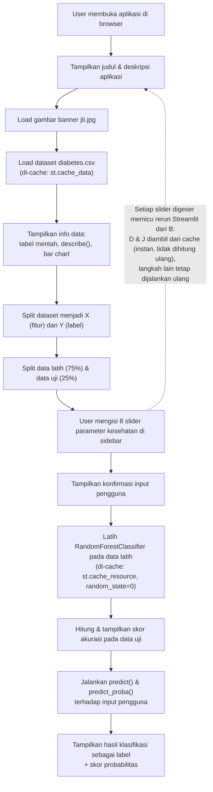

# Flow Map Aplikasi

Dokumen ini menggambarkan alur eksekusi aplikasi `WebApp.py` dari awal pengguna membuka halaman hingga hasil prediksi ditampilkan.

## Diagram Alur

## Penjelasan Tahapan

1. **Buka aplikasi** — Pengguna mengakses aplikasi melalui browser (`streamlit run WebApp.py`, default `http://localhost:8501`).
2. **Judul & deskripsi** — Streamlit merender judul "Diabetes Detection" dan deskripsi singkat aplikasi.
3. **Banner** — Gambar `jti.jpg` dimuat dan ditampilkan di bagian atas halaman.
4. **Load dataset** — `diabetes.csv` dibaca ke dalam `pandas.DataFrame` melalui fungsi yang di-cache dengan `st.cache_data`.
5. **Tampilkan info data** — Data mentah, statistik deskriptif, dan bar chart ditampilkan ke pengguna.
6. **Pisahkan fitur & label** — 8 kolom pertama dataset dijadikan `X` (fitur), kolom `Outcome` dijadikan `Y` (label).
7. **Split data latih/uji** — Dataset dibagi 75% untuk pelatihan, 25% untuk pengujian.
8. **Input pengguna** — Pengguna menggeser 8 slider di sidebar untuk memasukkan data kesehatannya.
9. **Konfirmasi input** — Nilai yang dimasukkan ditampilkan kembali dalam bentuk tabel.
10. **Latih model** — `RandomForestClassifier(random_state=0)` dilatih menggunakan data latih, melalui fungsi yang di-cache dengan `st.cache_resource`.
11. **Skor akurasi** — Akurasi model dihitung terhadap data uji dan ditampilkan.
12. **Prediksi** — Model memprediksi hasil klasifikasi (`predict`) dan skor probabilitasnya (`predict_proba`) berdasarkan input pengguna.
13. **Tampilkan hasil** — Hasil klasifikasi ditampilkan sebagai label yang mudah dipahami ("Terindikasi Diabetes" / "Tidak Terindikasi Diabetes") beserta skor probabilitasnya.

## Catatan Penting: Perilaku Rerun Streamlit

Streamlit tetap menjalankan ulang **seluruh script dari atas ke bawah** setiap kali terjadi interaksi pengguna (mis. menggeser slider). Namun karena langkah 4 (load dataset) dan langkah 10 (pelatihan model) dibungkus `st.cache_data`/`st.cache_resource`, kedua langkah tersebut **tidak dihitung ulang** pada rerun berikutnya — Streamlit langsung mengembalikan hasil dari cache selama argumennya (path dataset, data latih) tidak berubah. Yang benar-benar dijalankan ulang pada setiap interaksi hanyalah langkah 8–9 dan 11–13 (baca ulang input, hitung ulang akurasi dari model yang sudah ada, dan jalankan prediksi baru). Detail riwayat perbaikan performa ini ada di [`docs/SRS.md`](SRS.md#6-known-issues--batasan-teknis-saat-ini).
