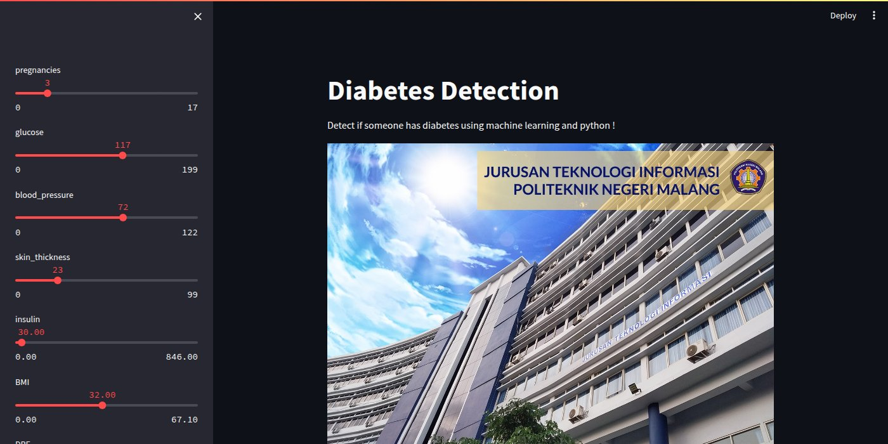
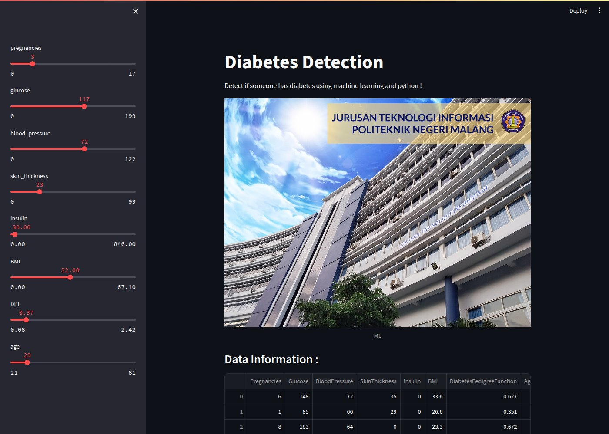
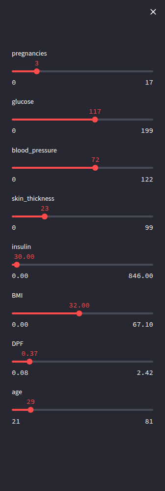

# Manual Book — Aplikasi Deteksi Diabetes

Panduan ini menuntun Anda memakai **Web Application for Diabetes Prediction Using Machine Learning** langkah demi langkah, lengkap dengan tangkapan layar tiap bagian antarmuka.

## Untuk Siapa Panduan Ini?

Panduan ini ditujukan untuk pengguna yang ingin langsung **memakai** aplikasi — bukan penjelasan teknis di balik layar. Untuk detail teknis tiap fitur, lihat [`FEATURES.md`](FEATURES.md); untuk alur sistem lihat [`FLOWMAP.md`](FLOWMAP.md).

## Prasyarat

Aplikasi harus sudah berjalan di komputer Anda. Jika belum, ikuti langkah instalasi di bagian [Instalasi & Menjalankan Secara Lokal](../Readme.md#instalasi--menjalankan-secara-lokal) pada `Readme.md`, lalu buka `http://localhost:8501` di browser.

---

## 1. Membuka Aplikasi

Saat pertama kali dibuka, aplikasi menampilkan judul **"Diabetes Detection"**, deskripsi singkat, dan banner institusi. Tema tampilan menggunakan **dark mode** secara default.

## 2. Melihat Informasi Dataset

Di bawah banner, aplikasi menampilkan bagian **"Data Information"** yang berisi:
- Tabel data mentah dari dataset Pima Indians Diabetes (768 baris data).
- Ringkasan statistik (`count`, `mean`, `std`, `min`, `max`, dst.) dari setiap kolom.
- Bar chart yang memvisualisasikan seluruh kolom dataset sekaligus.

Bagian ini murni informatif — menunjukkan data yang dipakai untuk melatih model, dan tidak perlu diinteraksikan oleh pengguna.

## 3. Mengisi Data Kesehatan di Sidebar

Di sisi kiri layar terdapat **sidebar** berisi 8 slider untuk memasukkan data kesehatan yang ingin diperiksa. Geser tiap slider sesuai kondisi yang ingin disimulasikan:

| Slider | Arti | Rentang Nilai |
|---|---|---|
| `pregnancies` | Jumlah kehamilan | 0 – 17 |
| `glucose` | Kadar glukosa plasma | 0 – 199 |
| `blood_pressure` | Tekanan darah diastolik (mm Hg) | 0 – 122 |
| `skin_thickness` | Ketebalan lipatan kulit trisep (mm) | 0 – 99 |
| `insulin` | Kadar insulin serum 2 jam (mu U/ml) | 0.0 – 846.0 |
| `BMI` | Indeks massa tubuh | 0.0 – 67.1 |
| `DPF` | Diabetes Pedigree Function (skor riwayat diabetes keluarga) | 0.078 – 2.42 |
| `age` | Usia (tahun) | 21 – 81 |

Setiap kali sebuah slider digeser, aplikasi otomatis memperbarui seluruh hasil di bawahnya (konfirmasi input, akurasi model, dan hasil klasifikasi).

## 4. Memeriksa Input yang Dimasukkan

Setelah mengisi slider, gulir ke bawah untuk melihat bagian **"User Input"** — tabel yang menampilkan kembali seluruh nilai yang baru saja Anda masukkan. Gunakan bagian ini untuk memastikan nilai yang dimasukkan sudah sesuai sebelum melihat hasil prediksi.

## 5. Melihat Skor Akurasi Model

Bagian **"Model Test Accuracy Score"** menampilkan seberapa akurat model dalam memprediksi data uji (25% dari dataset yang disisihkan khusus untuk pengujian).

> **Catatan:** skor ini mengukur performa model secara umum — bukan tingkat keyakinan terhadap prediksi Anda secara spesifik. Untuk itu, lihat skor probabilitas pada bagian Classification di bawah.

## 6. Melihat Hasil Klasifikasi

Bagian terakhir, **"Classification"**, adalah inti dari aplikasi ini — menampilkan hasil prediksi berdasarkan data yang Anda masukkan, berupa label yang mudah dipahami beserta skor probabilitasnya (seberapa yakin model terhadap prediksi tersebut).

Ada dua kemungkinan hasil:

**Contoh 1 — Nilai default (risiko rendah):**

**Contoh 2 — Nilai slider dengan profil risiko tinggi** (glucose, BMI, age, dan pregnancies digeser ke nilai yang lebih tinggi):

Semakin tinggi angka probabilitas, semakin yakin model terhadap label yang ditampilkan.

> ⚠️ **Penting:** Aplikasi ini adalah alat bantu edukatif/demonstratif, **bukan** alat diagnosis medis resmi. Hasil klasifikasi tidak menggantikan pemeriksaan dan konsultasi dengan tenaga medis profesional.

---

## Ringkasan Alur Penggunaan

1. Buka aplikasi di browser.
2. Lihat informasi dataset (opsional, hanya referensi).
3. Geser 8 slider di sidebar sesuai data kesehatan yang ingin diperiksa.
4. Periksa tabel konfirmasi input.
5. Lihat skor akurasi model (opsional, informasi performa model).
6. Lihat hasil klasifikasi beserta skor probabilitasnya.

Diagram alur lengkap tersedia di [`FLOWMAP.md`](FLOWMAP.md).

## Referensi

- [`FEATURES.md`](FEATURES.md) — penjelasan teknis tiap fitur.
- [`SRS.md`](SRS.md) — spesifikasi kebutuhan sistem & known issues.
- [`FLOWMAP.md`](FLOWMAP.md) — alur eksekusi aplikasi.
